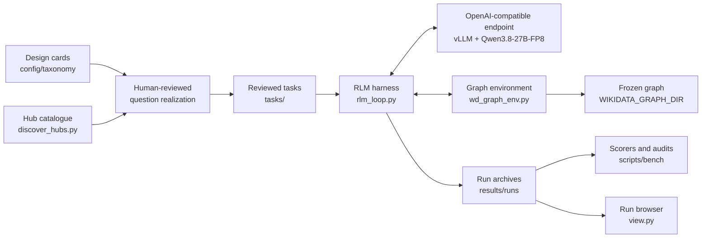

# Architecture

## System overview



## Components and ownership

| Component | Owns | Does not own |
|---|---|---|
| `question_design_cards.yaml` | Coverage requirements before data selection | Wording or concrete entities |
| Hub catalogue | Candidate relation pools and their measured volume | Semantic relevance |
| Task JSON | Question, allowed functions, turn limit, answer format and reference answer | The runtime protocol |
| `rlm_loop.py` | One-cell turns, the persistent REPL, delegation, provenance checks and archives | Graph storage or answer values |
| `wd_graph_env.py` | Graph access, entity text, name search and the read log | Task-specific reasoning |
| Model endpoint | Root code generation and sub-query judgement | Direct graph access |
| Scorers | Canonical, exact, LLM-free answer comparison, plus diagnostics | Trajectory style |

## The frozen graph

The graph is a local snapshot of Wikidata. It is read-only at runtime.

| Item | Value |
|---|---:|
| Nodes (items) | 48,026,283 |
| Deduplicated Q→Q edges | 262,090,238 |
| Text languages | English, French, German, Chinese, Arabic, Russian |

The graph has two classes of data, because they have different access
patterns:

- **Navigation index.** `edges_fwd.arrow` and `edges_bwd.arrow` hold the same
  edges sorted by source and by target. They are memory-mapped, so several
  processes share the same pages. `edges_bwd` makes incoming links available:
  those links are in the claims of other entities. `nodes.parquet` holds
  labels, descriptions, aliases, degrees and sitelinks per node.
- **Entity records.** `entities/part_NNNNN.parquet` holds one complete record
  per entity: claims with qualifiers, references and ranks. One lookup reads
  one part. `entities_index.json` maps QID ranges to parts.
- **Name index.** `label_index/` is a Tantivy index over labels and aliases in
  the six languages. It ranks results with a notability term (sitelinks and
  degree), so a famous entity is found among many homonyms.

## The graph environment

`WDGraphEnv` exposes Python functions. A task lists the functions that the
model can use (`allowed_functions`). The environment logs every call and every
identifier that the call returned.

| Function | Answers | Tasks that allow it |
|---|---|---:|
| `has(id)`, `name(id)` | Does the identifier exist, and what is its English label? | 56 |
| `search_entity(text, limit, lang)` | Which entities carry this name, and how many share it? | 53 |
| `edges(qid, direction, pid, limit)` | Which entities link to this one, and to which does it link? | 50 |
| `descriptions(qid)` | The descriptions in the six languages | 45 |
| `search_property(text, limit)` | Which property has this name, in any of the six languages? | 42 |
| `backlinks(qid, pid)` | Incoming links as `(pid, source, label)` tuples | 13 |
| `labels(qid)` | The labels in the six languages | 9 |
| `neighbors(qid, pid)` | Outgoing links as `(pid, target, label)` tuples | 2 |
| `claims(qid, pid)` | The statements of an entity, with qualifiers and ranks | 1 |
| `languages(qid)` | The target languages that describe the entity | 1 |

`edges` returns at most 200 edges per direction by default. The result reports
the degrees and a `truncated` flag, so the model can narrow the call with
`pid=` or `direction=`.

Two properties of the environment prevent silent errors:

- **Closed result schemas.** A result with a fixed schema refuses an invented
  key, also through `.get()`. The model receives a `KeyError` that it can read
  and repair, not a default value that turns a count into zero.
- **Known identifiers only.** An identifier that is not in the graph raises an
  error with a message that tells the model to use identifiers from results.

## The harness

`rlm_loop.py` runs one task. It builds a system prompt from the task, sends the
question to the model and executes one Python cell per turn.

### Turn protocol

1. The model replies with prose and exactly one ```` ```python ```` block.
2. The harness executes the block in a persistent namespace. Variables stay
   available in later turns.
3. The harness returns the printed output, truncated to the last 10,000
   characters. A bare expression on the last line echoes its value, as in an
   interactive REPL.
4. A reply with no block, or with more than one block, executes nothing. The
   model receives an explanation.
5. The model finishes with `FINAL(value)` or `FINAL_VAR(value)`.

Only root-model turns are limited, by `limits.turns` in the task. Graph reads
are measured but not capped.

### Delegation

The model can call a second model instance from inside a cell:

- `llm_query(text, instruction)` sends supplied text and an instruction. It
  returns prose.
- `llm_map({key: text, ...}, instruction)` sends the items in batches of 10.
  It returns one answer per key. A key that the sub-query drops comes back as
  `"NO ANSWER"`, so a missing verdict does not look like a negative verdict.

A sub-query has no graph access. It sees only the text that the root model
sends. `SUBQ_LIMIT` caps the number of sub-query calls for the whole run; each
`llm_map` batch counts as one call. The harness archives every sub-query
exchange in `sub_queries.json`.

`llm_map` removes plumbing. It does not decide when to delegate or what to ask:
the root model decides both. Its purpose is to keep a semantic filter over a
large candidate set in code, instead of in the model context.

### Provenance and shape checks

The harness checks `FINAL` before it accepts the answer. A rejected `FINAL`
does not end the run: the model receives the reason and can call `FINAL` again
in a later turn.

| Check | Rejects |
|---|---|
| Shape | Invalid JSON, a wrong top-level type, missing or extra keys, or labels where the format asks for QIDs. Only the form is compared, never the values. |
| Provenance | A QID or PID in the answer that the run did not read and the question did not supply. |
| Literal identifiers (tasks with `grounded_code`) | A cell that writes a QID or PID literal that the run has not read. The cell is not executed. |

### Search hints

With `RLM_SEARCH_HINTS=1`, an empty `search_entity` result tells the model which
words matched nothing. The name index is conjunctive: one unmatched word gives
an empty result for the whole query. The hint lets the model correct the word
instead of rephrasing without information.

### Thinking and the stop sequence

With thinking on, the harness sends no stop sequence. A stop sequence matches
the whole generated stream, and the model drafts code inside `<think>`, so a
stop would end the turn before the answer. This is safe because the vLLM
reasoning parser (`--reasoning-parser qwen3`) keeps `<think>` out of the
message content. The harness archives the reasoning text in `reasoning.json`.

## The model endpoint

The harness uses any OpenAI-compatible chat completions endpoint. The
reference configuration serves `unsloth/Qwen3.8-27B-FP8` with vLLM on one
80 GB GPU:

| Setting | Value | Reason |
|---|---|---|
| `--max-model-len` | 131072 | Only 16 of the 64 layers keep a growing KV cache. |
| `--kv-cache-dtype` | `fp8` | More KV cache in the same memory. |
| `--language-model-only` | on | The harness is text-only. The vision encoder memory goes to the KV cache. |
| `--reasoning-parser` | `qwen3` | Keeps `<think>` out of `content`. |
| `--speculative-config` | MTP, 3 tokens | Multi-token prediction for faster decoding. |
| `--max-num-seqs` | 8 | Server concurrency ceiling. |

The root model and the sub-queries use the same served model.

## Runtime invariants

- One Python cell executes per model turn.
- Variables persist across turns.
- The task exposes only its declared environment functions. `llm_query` is
  always available; `llm_map` is available when `RLM_LLM_MAP=1`.
- Graph reads are measured but not capped. Turns and sub-queries are capped.
- Identifiers in a final answer must come from the question or from a
  recorded environment result.
- The harness writes a checkpoint after each turn, so an interrupted run keeps
  its archive.
