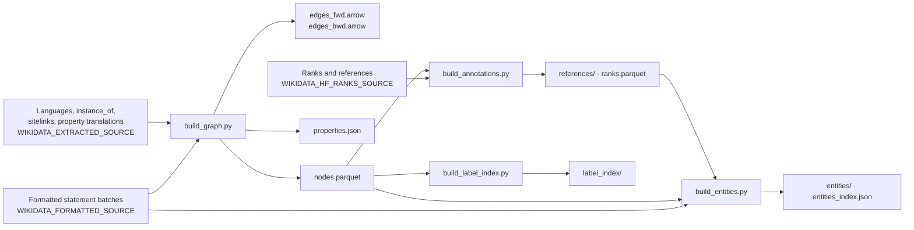
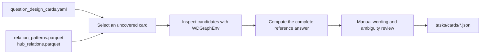
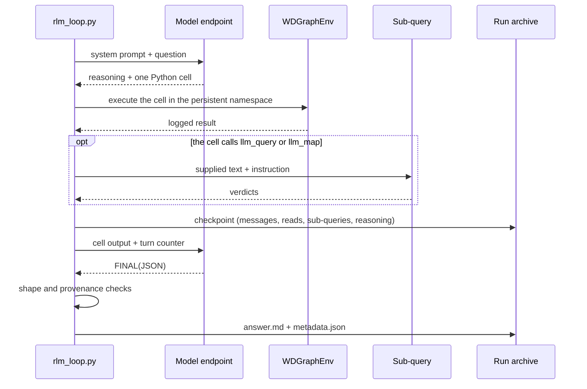

# Code flow

## Data preparation

All outputs go to `WIKIDATA_GRAPH_DIR`. The build order is:

1. `build_graph.py` (edges, then nodes and property labels)
2. `build_annotations.py`
3. `build_entities.py`
4. `build_label_index.py`

Every artifact keys on the integer QID. The build can run again from the raw
inputs at any time.

## Question construction

Cards set the experimental coverage. The hub catalogue narrows the graph
search. The person who designs the task is responsible for semantic necessity,
naturalness, completeness and exact evidence. See
[06 Question design](06-question-design.md).

## One run

## Run archive

Each run writes one directory, `<task_id>_<timestamp>/`:

| File | Contents |
|---|---|
| `question.txt` | The question shown to the model |
| `system_prompt.txt` | The complete system prompt |
| `messages.json` | All model replies and harness feedback, in order |
| `reasoning.json` | The thinking text of each turn (when thinking is on) |
| `read_log.json` | Every environment call, its arguments and the identifiers it returned |
| `sub_queries.json` | Every sub-query: turn, instruction, supplied text and response (when the run delegates) |
| `answer.md` | The accepted final answer |
| `metadata.json` | Status, turns, reads, tokens, timing and the generation settings |

## One batch

`run_batch.py` starts one subprocess per task. A failed API call costs one task
and not the batch. At the end it writes:

| File | Contents |
|---|---|
| `batch.json` | Task manifest, git revision, model, generation settings, progress and wall time |
| `scores.json` | One scored record per run (see [07 Evaluation](07-evaluation.md)) |
| `failures.json` | Subprocess diagnostics for tasks that produced no archive |

`scripts/run_reference.sh` adds the text reports `report_summary.txt`,
`report_scores.txt`, `report_coverage.txt`, `report_grounding.txt` and
`report_timing.txt`, and the endpoint probe report `probe.json`.
