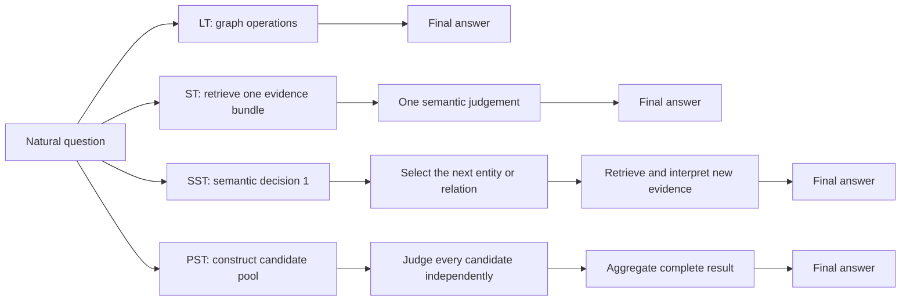
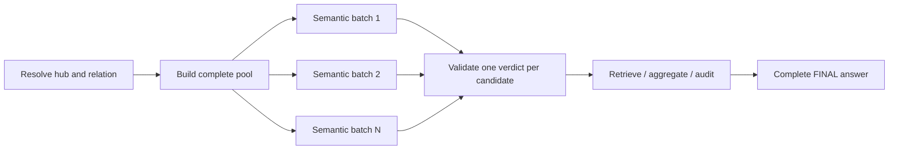

# Question design

This document explains what the benchmark questions test, how the question
families differ, and how abstract design cards become concrete, answerable
Wikidata tasks. It is self-contained.

## Purpose

The project does not aim to test whether a language model memorized a famous
Wikidata fact. It tests whether an agent can use a frozen graph to:

1. resolve the entities and relations named in a natural question;
2. navigate and compute over graph links;
3. read textual evidence when links alone are insufficient;
4. combine intermediate results across several steps;
5. return a complete, mechanically scoreable answer grounded in the graph.

The benchmark contains **50 manually reviewed tasks** generated from
**18 design cards**, plus **3 certified hard tasks** and **3 name-only tasks**
(see [Certified hard tasks and name-only tasks](#certified-hard-tasks-and-name-only-tasks)).
A design card specifies the kind of reasoning wanted before any concrete
Wikidata entities are chosen. It is a coverage target, not a prompt template.

## What data a question can use

The agent works against a frozen local Wikidata snapshot. The relevant evidence
comes in two forms:

- **structured graph evidence:** entities, properties, outgoing links, incoming
  links, claims, references and counts;
- **textual evidence:** labels and descriptions in English, French, German,
  Chinese, Arabic and Russian.

This distinction matters. A question such as “which languages are connected to
both Australia and India?” can be solved by set intersection. A question such
as “which people are described as combining writing and activism?” requires
interpreting text. The latter cannot be reduced to one canonical Wikidata
property without changing the information need.

Questions deliberately omit QIDs, PIDs, function names and search instructions.
The agent must discover how to answer them. The phrase “work only in the
provided graph” prevents external knowledge from replacing graph evidence.

## The design frame

Each card combines four kinds of decisions:

```yaml
execution_target:
  pattern: LT | ST | SST | PST
objective:
  type: retrieve | aggregate | audit
candidate_set:
  operation: pool | intersection | difference
modifiers:
  volume: low | medium | high
  cross_lingual: true | false
  obscurity: low | medium | high
```

The order is intentional. The execution pattern determines the shape of the
reasoning. The objective determines the requested result. The candidate-set
operation determines where candidates come from. Modifiers control difficulty.

### Execution patterns

The distinction between patterns is whether the agent must interpret an
observation before it can continue.



| Pattern | Full name | Defining property | Typical agent behaviour |
|---|---|---|---|
| `LT` | Logical turn | No intermediate output needs semantic interpretation | Resolve IDs, traverse links, compute sets or counts in Python |
| `ST` | Semantic turn | One evidence bundle requires interpretation | Resolve one entity, read its descriptions, extract or classify a fact |
| `SST` | Sequential semantic turns | One semantic result determines what must be retrieved next | Identify A from text, follow A's relation to B, then inspect B |
| `PST` | Parallel semantic turns | The same semantic decision applies independently to a pool | Build the full pool, classify every member, aggregate and verify coverage |

“Turn” here describes a dependency pattern, not a guaranteed number of model
messages. An LT task may require several REPL messages because the agent first
has to discover the right property. What makes it logical is that the outputs
can be consumed deterministically by code. Conversely, an ST decision can be
made by the root model or delegated through `llm_query`/`llm_map`; it remains a
semantic operation either way.

### Objectives

| Objective | Question answered | Typical output |
|---|---|---|
| `retrieve` | Which entity or complete set satisfies the conditions? | One entity, a set and exact evidence |
| `aggregate` | What count, ranking, grouping or comparison follows? | Winner, maximum, counts or partitions |
| `audit` | Which records are missing, inconsistent or suspicious? | Complete anomaly set with evidence |

Audit questions model a realistic Wikidata contributor use case. The correct
answer can be a contradiction or an incomplete record rather than a unique
fact.

### Candidate-set operations

| Operation | Meaning | Example |
|---|---|---|
| `pool` | Start from every entity linked to one hub or condition | Every employee of Amnesty International |
| `intersection` | Keep candidates present in two sets | Works filmed in both New York and London |
| `difference` | Keep candidates in A but not B | Entries in Top 2000–2018 but not Top 2000–2020 |

### Difficulty modifiers

| Modifier | What it changes |
|---|---|
| `volume` | Number of candidates or links that must be reviewed |
| `cross_lingual` | Whether decisive evidence occurs outside English or emerges by comparing languages |
| `obscurity` | How unlikely the answer is to be available from model memory |

Difficulty can also come from exhaustive coverage, logical composition and
semantic dependency. At least one real difficulty source must be present. A
question is not considered difficult merely because it asks the model to avoid
an otherwise useful property or tells it where to look.

## Corpus overview

| Family | Design cards | Concrete tasks | Core capability |
|---|---:|---:|---|
| LT | 4 | 10 | Deterministic graph computation |
| ST | 3 | 9 | One semantic reading |
| SST | 4 | 15 | Semantic relay across dependent steps |
| PST | 7 | 16 | Exhaustive semantic work over pools |
| **Total** | **18** | **50** | |

## LT — deterministic graph questions

LT questions establish whether the agent can resolve entities and properties,
handle edge direction correctly, and perform complete set operations. They do
not require a language model to judge the meaning of descriptions.

### `LT_RETRIEVE_ALL_INTERSECTION_VOLUME` — common members of two sets

**Logic:** construct sets A and B from graph relations, calculate `A ∩ B`, and
return every member.

**Why it is difficult:** the input sets can be large; a plausible sample is not
enough. Edge direction and pagination must be correct.

**Concrete task:** “According to the graph's language-used relation, which
languages are linked to both Australia and India?”

**Expected result:** nine languages: French, Hindi, Urdu, English, Gujarati,
Tamil, Bangla, Malayalam and Punjabi.

### `LT_RETRIEVE_ALL_DIFFERENCE_OBSCURE` — members unique to one set

**Logic:** construct sets A and B, calculate `A − B`, and return every member.

**Why it is difficult:** the entities and relations are deliberately obscure,
so memorization is of little help. Completeness still matters.

**Concrete task:** “Which entries belong to Top 2000 – 2018 but not to Top
2000 – 2020?”

**Expected result:** Living Doll, Elevation, Grace and Waarom nou jij; count 4.

### `LT_AUDIT_CONFLICT_POOL_VOLUME` — structural anomaly audit

**Logic:** enumerate every target reached from a hub by relation P, then test
whether every target links back through the same relation.

**Why it is difficult:** this is a universal audit, not a lookup. The agent must
distinguish a genuinely asymmetric link from an unexamined candidate.

**Concrete task:** “Audit every target of Russia's diplomatic-relation links.
Which targets do not link back to Russia through the same relation?”

**Expected result:** 153 targets reviewed; Donetsk People's Republic and
Luhansk People's Republic are the two anomalies.

### `LT_AGGREGATE_RANK_POOL_VOLUME` — rank a complete pool

**Logic:** build a pool, compute a numeric value for every member, find the
maximum and preserve all ties.

**Why it is difficult:** the winner cannot be known safely before every
candidate has been counted.

**Concrete task:** “Among all works recorded as having been filmed in Berlin,
which work has the largest number of recorded cast members?”

**Expected result:** 245 works reviewed; The Baader Meinhof Complex wins with
114 recorded cast members.

## ST — one semantic decision

ST questions require one bundle of text to be interpreted. The semantic gate
may resolve an ambiguous name, extract a fact expressed only in prose, or read
evidence in a non-English language.

### `ST_RETRIEVE_ONE_DISAMBIGUATION` — distinguish homonymous entities

**Logic:** retrieve all entities matching a name, then use relational and
textual evidence to identify their roles.

**Why it is difficult:** labels alone are insufficient; choosing the first
search result produces a plausible but wrong answer.

**Concrete task:** “Peter Tuckermann had two wives who are both recorded under
the name Anna Tuckermann. Identify his first wife, his second wife, and which
of them founded an orphanage.”

**Expected result:** Q55905866 is the first wife; Q111630649 is the second wife
and orphanage founder. The decisive German description calls her a
“Waisenhausstifterin” and Peter Tuckermann's second wife.

### `ST_RETRIEVE_ONE_TEXTUAL_FACT` — extract a fact from one description

**Logic:** resolve the subject, read its descriptions and extract the requested
fact with the exact supporting text.

**Why it is difficult:** the fact is not necessarily represented by a dedicated
graph property, and may occur only in one language.

**Concrete task:** “The 2007 Morocco–Spain diplomatic conflict concerned two
cities claimed by Morocco. Which cities were they?”

**Expected result:** Ceuta and Melilla, supported by an Arabic description that
explicitly names both cities.

### `ST_RETRIEVE_ONE_CROSS_LINGUAL` — decisive non-English evidence

**Logic:** resolve one entity and interpret a description in one of the six
stored languages.

**Why it is difficult:** English evidence alone is insufficient. The model must
find and correctly interpret the decisive language without being told where it
is.

**Concrete task:** “Which publication issued in Shenyang is described as a
reference work covering all fish, amphibians, reptiles, birds and mammals then
known in China? How many species does it contain?”

**Expected result:** Chinese Vertebrate Encyclopedia; 5,534 species, supported
by its Chinese description.

## SST — sequential semantic questions

SST questions contain a real dependency: interpreting the first evidence
selects the entity or relation needed for the second step. The entire chain
cannot be prepared before the first semantic result is known.

General form:

```text
resolve a candidate pool
→ interpret descriptions to select entity A
→ follow a relation from A to entity B
→ retrieve and interpret evidence about B
→ answer
```

### `SST_RETRIEVE_ONE_RESOLVE_THEN_INSPECT` — resolve, navigate, inspect

**Logic:** use a textual clue to identify the correct source entity, follow a
graph relation, then inspect the target's text.

**Concrete task:** identify the Burgas Oblast that existed from 1987 to 1999,
follow its capital, and find the description calling that city its
administrative centre.

**Expected result:** Q91611321 is the historical oblast; its capital is Burgas
(Q6509); a Russian description identifies Burgas as the administrative centre
of Burgas Oblast.

### `SST_RETRIEVE_ONE_ROLE_GATED` — a semantic role opens the next hop

**Logic:** identify a person or work by a role expressed in text, then follow a
relation available only after that identification and inspect the target.

**Concrete task:** among PBS employees, identify the person described simply as
a documentary producer, follow their notable work, and find descriptions that
attribute it to the Coen brothers.

**Expected result:** Christopher Buchanan → Raising Arizona; Arabic, German,
English and Russian descriptions attribute the film to the Coen brothers.

### `SST_RETRIEVE_ONE_CROSS_LANGUAGE_RELAY` — evidence relayed across languages

**Logic:** one language identifies entity A; a relation leads to B; another
language supplies the final fact. Languages contribute at different points in
the chain rather than merely translating the same answer.

**Concrete task:** identify the judo practitioner described in Russian as one
of sambo's creators, follow his trainer relation, then find the languages that
describe the trainer as judo's creator or founder.

**Expected result:** Vasili Oshchepkov → Kanō Jigorō; the relevant descriptions
are German, French, Russian and Chinese.

### `SST_AUDIT_SOURCE_DRILLDOWN` — follow evidence to audit its source

**Logic:** identify an entity semantically, follow a source relation, then
inspect the linked source to decide whether it plausibly supports the subject.

**Concrete task:** identify the Amnesty employee described in Russian as a
Taiwanese writer, journalist, translator, dissident and historian, then audit
his described-by-source links.

**Expected result:** the person is Bo Yang; the suspect source is *Fishes of
the Yellow River and Beyond*, whose English description says it is a book by
Sizhong Li.

## PST — exhaustive semantic questions over pools

PST questions are the main stress tests. The agent first constructs a complete
candidate pool using graph logic, then applies the same semantic test to every
candidate. Each judgement is independent, so it can be delegated or batched,
but the final answer must account for the entire pool.



These tasks expose context rot: printing hundreds of descriptions and selecting
from memory is unreliable even when the correct evidence appeared earlier.
The harness therefore provides `llm_map`, which batches keyed descriptions and
returns one verdict per key. It changes the execution strategy, not the task or
gold answer.

### `PST_RETRIEVE_ALL_SEMANTIC_FILTER` — filter a pool by meaning

**Logic:** enumerate a graph-defined pool, read descriptions for every member,
apply one semantic inclusion rule, and return every match with evidence.

**Concrete task:** among 114 Amnesty International employees, find everyone
described as combining literary or artistic work with activism, human-rights
advocacy or dissidence.

**Expected result:** seven people, supported by English, German and Russian
descriptions. Examples include Urs M. Fiechtner (“German writer and human
rights activist”) and Bo Yang (a Russian description combining writer,
journalist, translator and dissident).

### `PST_RETRIEVE_ALL_INTERSECTION_FILTER` — logical intersection then semantics

**Logic:** compute `A ∩ B`, then semantically classify every entity in the
intersection.

**Concrete task:** among works filmed in both New York City and London, which
are explicitly described as documentaries?

**Expected result:** 29 intersection candidates reviewed; *One Direction: This
Is Us* and *Brian Clarke: The Story So Far (1979)* match.

### `PST_AGGREGATE_COMPARE_HUBS` — compare semantic populations

**Logic:** construct pools for two hubs, classify every member using the same
criterion, count matches and compare the resulting populations.

**Concrete task:** compare Amnesty International and PBS employees described as
combining literary, artistic or media work with activism or dissidence.

**Expected result:** Amnesty has 7 matches from 114 employees; PBS has 1 from
45; Amnesty International wins.

### `PST_AGGREGATE_COUNT_CROSS_LINGUAL` — count multilingual matches

**Logic:** build a large pool, search all available descriptions for a semantic
criterion, and count the complete cross-lingual result.

**Concrete task:** among 245 works filmed in Berlin, find those described as
documentaries about mass surveillance.

**Expected result:** one work, *Citizenfour*, identified by a Russian
description mentioning Edward Snowden and mass surveillance.

### `PST_AGGREGATE_PARTITION` — semantically group every candidate

**Logic:** construct a filtered pool, assign each member to exactly one semantic
group, preserve an unstated/unknown group, and verify that group counts sum to
the pool size.

**Concrete task:** partition Amnesty employees without a citizenship link by
the nationality explicitly suggested in their descriptions.

**Expected result:** 19 people partitioned into American (3), German (5),
Puerto Rican (1) and unstated (10).

### `PST_AUDIT_MULTILINGUAL_CONFLICT` — find contradictions between languages

**Logic:** inspect all language descriptions for every candidate, normalize the
relevant facts, and report only incompatible claims with the exact conflicting
texts.

**Concrete task:** audit 245 works filmed in Berlin for incompatible production
or release years across languages.

**Expected result:** six anomalies. For example, *V for Vendetta* is described
as a 2005 film in English, French and German but as a 2006 film in Chinese.

This is not a translation task. The target is the disagreement between
language-specific records.

### `PST_AUDIT_MISSING_FACT` — detect enrichment candidates

**Logic:** find records missing a structured property, inspect their text for
an explicit candidate value, and return evidence without silently editing the
graph.

**Concrete task:** audit all Amnesty employees; among the 19 people without a
country-of-citizenship link, find descriptions that explicitly suggest a
nationality.

**Expected result:** nine potential enrichment candidates, including English
and German evidence. The output records the suggested nationality and exact
description for human review.

## Certified hard tasks and name-only tasks

Six tasks complete the benchmark. They do not come from a design card. Each
one isolates one failure mode of an agent, and each one carries a
`certificate` that states why a shortcut fails.

| Task | What it tests | Why a shortcut fails |
|---|---|---|
| `HARD_01_taxonomic_rank_from_descriptions` | For 12 species, find the nearest ancestor taxon that is a family. | The taxon-rank property is removed from the task world, so rank is only in description text. Every chain passes a "subfamily", which contains the string "family". Some descriptions exist only in other languages. |
| `HARD_02_homonym_needs_native_description` | Two people with the identical label "Anna Tuckermann": which one is the first wife, the second wife and the orphanage founder? | The labels are identical and neither person has an English description. Only a German description separates them, and the answer must quote it exactly. |
| `HARD_03_certified_kinship_absence` | Are two people named "Gerhard Schröder" connected by family links? | A direct non-kinship link joins them. The correct answer is "no", and it is scored on the complete kinship component, so a "no" that stops early fails. |
| `HIDE_HARD_01_taxonomic_rank_from_descriptions` | HARD_01 with species names only. | The agent must first resolve 12 names to entities. |
| `HIDE_MH_ancestor_genealogy_003` | The nearest common ancestors of two people, with distances and paths. | The people are named, not identified, and the parent relations must be found in the graph. |
| `HIDE_MH_shared_hub_058` | The workplaces shared by five named people, and the total per person. | Five name resolutions, then an intersection and exact counts. |

The name-only tasks (`HIDE_`) give names instead of QIDs. They test the
`search_entity` path: name resolution in a graph where many labels are shared.

## How cards become concrete questions

Question creation is intentionally semi-manual:

1. **Select a card.** Prefer an underrepresented reasoning pattern.
2. **Find a usable hub or relation pattern.** Use the taxonomy datasets to
   locate pools with suitable volume and obscurity.
3. **Inspect the graph.** Verify edge direction, candidate count, labels,
   descriptions and language coverage with `WDGraphEnv`.
4. **Test semantic necessity.** Ensure the requested judgement is not already
   answered completely by an obvious structured property.
5. **Compute the gold.** Enumerate the full candidate set and store a canonical
   expected answer from the frozen snapshot.
6. **Write the natural question.** State the information need, not the solution
   procedure. Do not leak QIDs, PIDs, tool names or decisive languages.
7. **Run a pilot.** Inspect whether the agent follows the intended dependency
   and whether the task is too easy, ambiguous or operationally impossible.
8. **Accept or revise.** Keep only tasks whose answerability, completeness,
   naturalness and claimed difficulty are supported by the data.

Question wording is not generated deterministically. Candidate sampling and
gold computation can be reproducible, but deciding whether a semantic gate is
natural and genuinely necessary requires manual review.

## Sources of truth

| Artifact | Role |
|---|---|
| `config/taxonomy/question_design_cards.yaml` | Declarative list of the 18 design cards |
| `relation_patterns.parquet` (output of `scripts/taxonomy/discover_hubs.py`) | Relation patterns ranked by support, volume and obscurity |
| `hub_relations.parquet` (output of `scripts/taxonomy/discover_hubs.py`) | Concrete hubs, directions, properties and candidate pools |
| `tasks/cards/*.json` | The 50 reviewed questions and deterministic gold answers |
| `tasks/hard/*.json`, `tasks/nameonly/*.json` | The 6 certified hard and name-only tasks |

The YAML catalogue defines experimental coverage. The task JSON files define
what is actually runnable and scoreable. Code must not duplicate the card list.

## Runnable task contract

Each reviewed task has one JSON object:

```json
{
  "id": "SST_RETRIEVE_ONE_ROLE_GATED_001",
  "design_card": "SST_RETRIEVE_ONE_ROLE_GATED",
  "question": "Natural information need",
  "taxonomy": {
    "category": "semantic",
    "type": "sst_retrieve_one_role_gated"
  },
  "allowed_functions": [
    "search_entity",
    "edges",
    "descriptions"
  ],
  "limits": {
    "turns": 12
  },
  "answer": {
    "schema": "canonical",
    "format": "Exact FINAL JSON instruction",
    "expected": {}
  }
}
```

- `question` is the only task content shown as the user request.
- `allowed_functions` exposes only environment operations needed by the task.
- `limits.turns` is the task-specific interaction limit.
- `answer.format` tells the model the required output shape.
- `answer.expected` is hidden from the model and used by the deterministic
  scorer; no LLM judge decides correctness.
- `answer.bookkeeping` (optional) names the fields that count the candidate
  set rather than the answer, such as `reviewed`. The content-exact score
  ignores them (see [07 Evaluation](07-evaluation.md)).
- `qids` (optional) lists identifiers that the question supplies. They are
  available in the REPL as `task_qids`.

`llm_query` and, when enabled, `llm_map` are harness primitives rather than
task-specific graph functions. Their global budget is controlled by
`SUBQ_LIMIT`.

## Review checklist

A task is acceptable only when:

- every required entity, relation and quoted text exists in the frozen graph;
- the expected answer is complete and canonical;
- the question is plausible and does not leak a solution procedure;
- structured properties do not eliminate the claimed semantic gate;
- SST dependencies are genuinely sequential;
- PST judgements are independently applicable to the full candidate pool;
- cross-lingual evidence changes what can be answered rather than decorating
  the task;
- exhaustive claims are supported by a full graph traversal, not a sample;
- at least one real difficulty source exists: semantics, volume, obscurity,
  language or composition.
